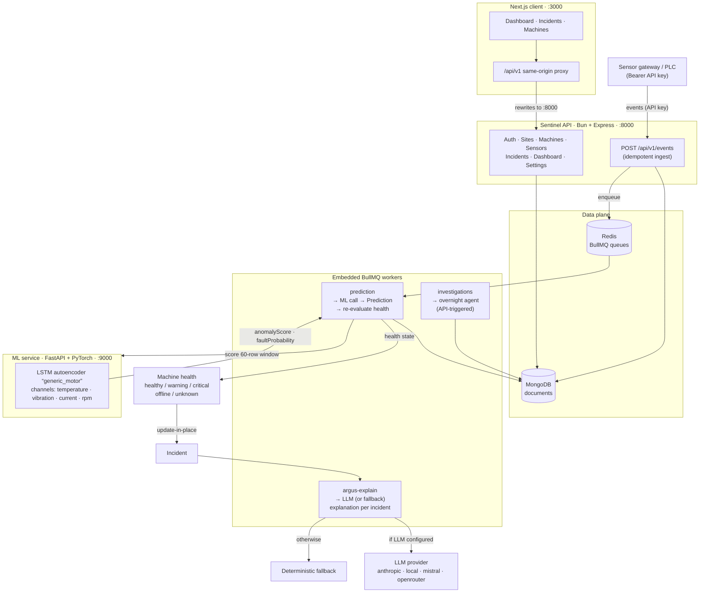
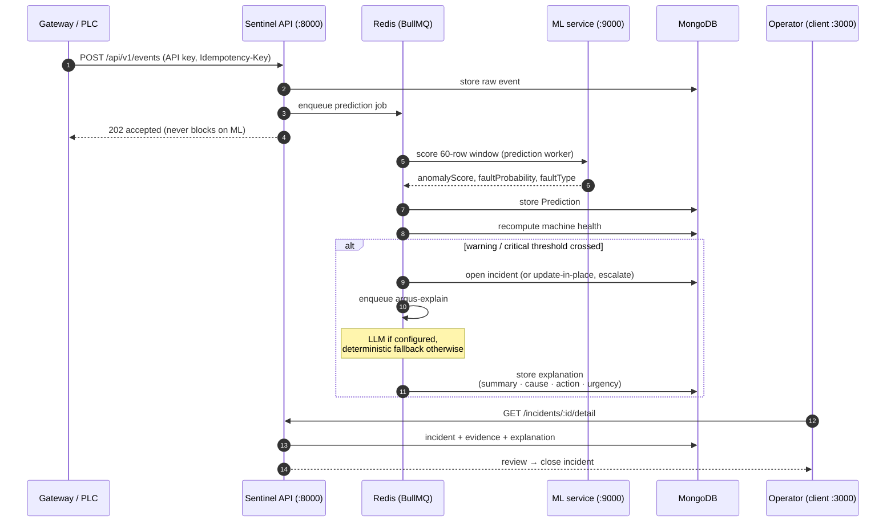
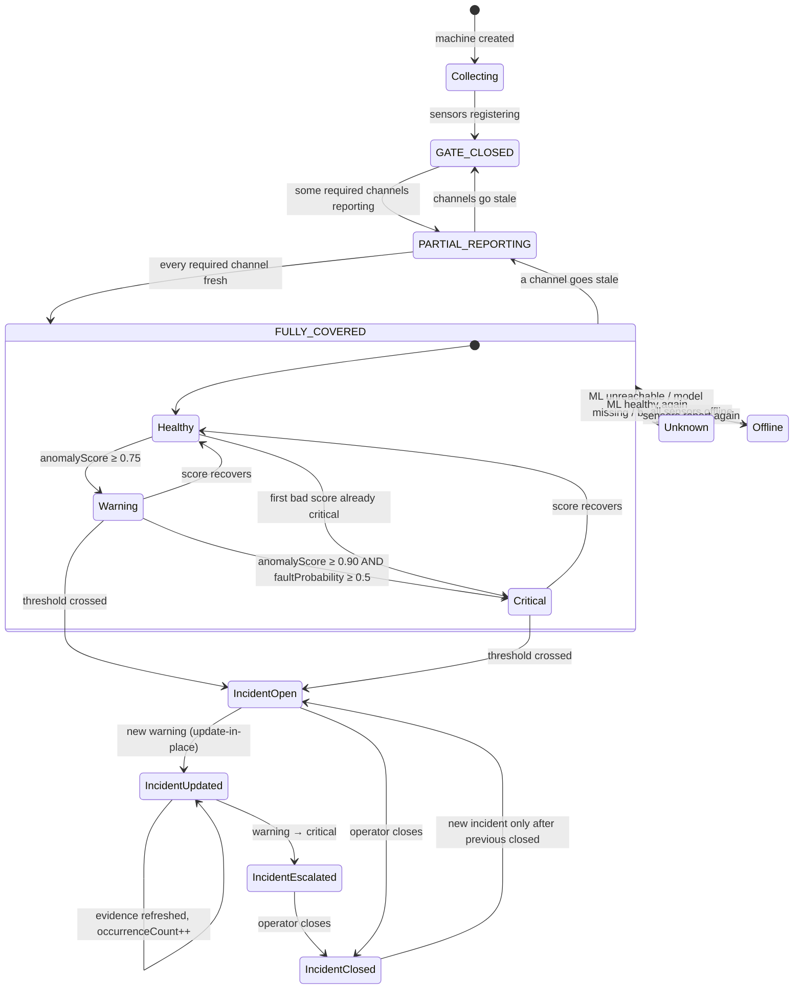
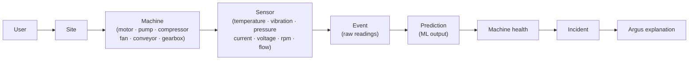

<div align="center">

# Sentinel

**Industrial predictive maintenance — from raw sensor readings to actionable incidents.**

Sentinel connects industrial machines, ingests their sensor readings, and turns those
readings into machine-health calls and actionable incidents. Sensor events are scored
asynchronously by an LSTM autoencoder ML service; when a machine crosses deterministic
health thresholds, Sentinel raises (or escalates) a single incident for that machine and
generates an explanation of what is happening and what to do next — from an LLM when one
is configured, or from a deterministic fallback when it is not.

[Architecture](#architecture) · [Data flow](#data-flow) · [Quick start](#local-development) · [API](#api) · [Demo](#demo-environment) · [Deployment](#deployment)

</div>

---

## Contents

- [At a glance](#at-a-glance)
- [Architecture](#architecture)
- [Data flow](#data-flow)
- [Incident lifecycle](#incident-lifecycle)
- [Domain model](#domain-model)
- [What a user does end to end](#what-a-user-does-end-to-end)
- [Health thresholds](#health-thresholds)
- [ML predictions](#ml-predictions)
- [API](#api)
- [Event ingestion](#event-ingestion)
- [Local development](#local-development)
- [Environment variables](#environment-variables)
- [Google Sign-In](#google-sign-in)
- [Tests](#tests)
- [Demo environment](#demo-environment)
- [Deployment](#deployment)
- [Not in Sentinel (yet)](#not-in-sentinel-yet)

---

## At a glance

| | |
| --- | --- |
| **Product** | Sentinel — industrial predictive maintenance |
| **AI analyst** | Argus — per-incident explanations, with deterministic fallback |
| **Design language** | Night Watch |
| **Model** | Single-user — every record is scoped to a `userId`; no organizations or roles |

| Piece | What it is |
| --- | --- |
| **Server** | Bun + Express 4, Mongoose, BullMQ, Zod validation, pino logging, Helmet/CORS/rate limiting ([server/](server)) |
| **Client** | Next.js (App Router) + React 19, Tailwind 4, TanStack Query, Radix UI ([client/](client)) |
| **ML service** | FastAPI + PyTorch LSTM autoencoder; scores 60-row windows, stateless ([ml-service/](ml-service)) |
| **MongoDB** | Users, sites, machines, sensors, events, predictions, incidents, investigations |
| **Redis + BullMQ** | Prediction, argus-explain, and investigation queues (workers run embedded in the server) |
| **Tests** | Bun test (server), pytest (ML service) |

The stack **degrades gracefully**: if the ML service is down or a model is missing,
machines are marked `unknown` with a reason rather than scored wrongly; if no LLM is
configured, incidents still get deterministic fallback explanations.

---

## Architecture



Workers run embedded in the server process — no separate worker service.

---

## Data flow

From a sensor reading to an operator-visible, explained incident:



Key properties of this flow:

- **Ingest never blocks on inference** — scoring happens on the queue.
- **One incident per machine, updated in place** — evidence refreshed,
  `occurrenceCount` bumped, `warning → critical` escalation when a worse prediction
  arrives. A new incident is only created after the previous one is closed.
- **Incidents only come from real scored states** — never from `unknown` or `offline`.

---

## Incident lifecycle



### Coverage gate

A machine becomes `FULLY_COVERED` — and predictions start — only when **every channel
its type requires** has a sensor reporting within the recency window (default 15 min):

- All machine types need the 4 ML channels: **temperature, vibration, current, rpm**.
- **Compressors and pumps additionally require pressure.**
- Gate states: `GATE_CLOSED` → `PARTIAL_REPORTING` → `FULLY_COVERED`.

---

## Domain model



---

## What a user does end to end

1. Register / log in (email + password with OTP verification, or Google Sign-In).
2. Create a site, register machines, attach sensors.
3. Create an API key (shown once; only its SHA-256 hash is stored).
4. Point the machine's gateway at `POST /api/v1/events` with that key.
5. Watch the **coverage gate**: sensors come online one by one, the gate opens, and
   predictions start (see [Incident lifecycle](#incident-lifecycle)).
6. Sensor events are stored, queued, scored, and machine health is recomputed.
7. Crossing a threshold opens one incident per machine — subsequent warnings update
   that incident in place and escalate `warning → critical` when a worse prediction
   arrives.
8. Argus produces the incident's explanation (summary, likely cause, recommended
   action, urgency `now/soon/monitor`); the operator reviews and closes the incident.

---

## Health thresholds

Deterministic rules in
[server/src/services/machine-health.service.js](server/src/services/machine-health.service.js) —
**never LLM-driven**:

| State | Condition |
| --- | --- |
| `CRITICAL` | `anomalyScore >= 0.90` **AND** `faultProbability >= 0.5` |
| `WARNING` | `anomalyScore >= 0.75` |
| `HEALTHY` | below warning |
| `OFFLINE` | all of the machine's sensors are offline |
| `UNKNOWN` | ML unreachable / model not loaded / bad ML response / missing channels / still collecting |

`faultProbability` is a **persistence statistic**: it can confirm a CRITICAL but never
create one on its own. Incidents are only raised from real scored states — never from
`unknown` or `offline`.

---

## ML predictions

The only model is an **LSTM autoencoder (`generic_motor`)** trained on healthy data,
served by FastAPI. Per [ml-service/README.md](ml-service/README.md):

- **No RUL:** `rulValue` / `rulUnit` are always `null` — "not available", never `0`.
- `faultType` is `"<channel>_anomaly"` (the channel deviating most), or `"none"`.
- `anomalyScore = clip(error / (2 × threshold), 0, 1)`; `faultProbability` is the
  fraction of the last 10 windows over threshold; `confidence` is data sufficiency.
- Free-text machine types map onto `generic_motor` (motors, pumps, compressors, fans,
  conveyors, gearboxes — anything else too).

The event pipeline builds a **60-row window** per machine from per-sensor events,
forward-filling channel gaps only when the last value is younger than
`CHANNEL_MAX_AGE_SEC` (default 300 s). A channel never seen, or too stale, makes the
machine unscoreable until it reports again.

---

## API

All routes are prefixed `/api/v1`. Interactive routes require JWT auth
(httpOnly cookies + refresh rotation); ingestion requires an API key.

| Group | Routes |
| --- | --- |
| **Auth** | `POST /auth/register` · `/auth/login` · `/auth/google` · `/auth/verify-email` · `/auth/refresh-token` · `/auth/forgot-password` · `/auth/reset-password` · `/auth/logout` · `/auth/change-password` · `/auth/resend-email-verification` · `GET /auth/current-user` |
| **Sites** | `GET/POST /sites` · `GET/PATCH/DELETE /sites/:siteId` |
| **Machines** | `GET/POST /machines/sites/:siteId/machines` · `GET/PATCH/DELETE /machines/:machineId` · `GET /machines/:machineId/coverage` · `GET /machines/coverage` · `GET /machines/:machineId/detail` |
| **Sensors** | `GET/POST /sensors/machines/:machineId/sensors` · `GET/PATCH/DELETE /sensors/:sensorId` · `GET /sensors/summary` |
| **Events** | `POST /events` (API key) · `GET /events` · `GET /events/:eventId` |
| **Predictions** | `GET /predictions/machines/:machineId[/latest]` · `GET /predictions/:predictionId` |
| **Incidents** | `GET /incidents` · `GET /incidents/:incidentId[/detail][/graph]` · `PATCH /incidents/:incidentId/status` · `POST /incidents/:incidentId/explain` |
| **Investigations** | `POST /investigations/start` · `GET /investigations/:investigationId` |
| **Dashboard** | `GET /dashboard` |
| **API keys** | `GET/POST /settings/api-keys` · `DELETE|PUT /settings/api-keys/:keyId` — legacy single-key surface: `/settings/api-key` |
| **Health** | `GET /health` · `GET /health/full` |
| **Dev only** | `POST /api/v1/test/*` (seed helpers; never mounted in production) |

---

## Event ingestion

```bash
curl -X POST http://localhost:8000/api/v1/events \
  -H "Authorization: Bearer sk_..." \
  -H "Idempotency-Key: reading-0001" \
  -H "Content-Type: application/json" \
  -d '{
    "siteId": "site_...",
    "machineId": "machine_...",
    "sensorId": "sensor_...",
    "timestamp": "2026-09-30T06:30:00Z",
    "type": "sensor_reading",
    "values": { "temperature": 82.4, "vibration": 7.31, "current": 14.8, "rpm": 1480 },
    "source": "gateway"
  }'
```

- **Retries are safe:** pass an `Idempotency-Key`, or the backend derives a
  deterministic SHA-256 fingerprint from the payload. Idempotency is scoped per user;
  a reused key with a **different** payload is rejected.
- The API **never blocks on ML inference** — scoring happens on the queue.

---

## Local development

Prerequisites: [Bun](https://bun.sh), Python 3.11+, Docker.

```bash
# 1. Data plane only (Mongo 7 + Redis 7 on their default ports)
docker compose -f docker-compose.dev.yml up -d

# 2. Train the ML checkpoint (models/*.pt is gitignored — this step is
#    mandatory on a fresh clone; /predict returns 503 without it)
cd ml-service
pip install -r requirements-dev.txt      # CPU torch: pip install torch --index-url https://download.pytorch.org/whl/cpu
python train/train_autoencoder.py --synthetic --out models/generic_motor

# 3. ML service on :9000
python -m app

# 4. Server on :8000 (embedded workers start with it)
cd ../server
cp .env.example .env                     # fill in the required values
bun install
bun run dev

# 5. Client on :3000 (proxies /api/v1 → :8000)
cd ../client
npm install
npm run dev
```

- `bun run dev` is wrapped in `infisical run --env=dev`; if you don't use Infisical,
  run `bun run dev:dotenv` (plain `bun --watch src/index.js`) instead.
- The server loads `./.env` itself; the client needs no env file for local dev.
- The client talks to the API same-origin (`/api/v1` via a Next.js rewrite to
  `http://localhost:8000`).

---

## Environment variables

### Server

See [server/.env.example](server/.env.example); [docker-compose.yml](docker-compose.yml)
shows the production wiring.

```bash
NODE_ENV=development
PORT=8000
MONGODB_URL=mongodb://localhost:27017/sentinel
REDIS_URL=redis://localhost:6379
CORS_ORIGIN=http://localhost:3000

ACCESS_TOKEN_SECRET=<random>            # JWT signing (access / refresh)
REFRESH_TOKEN_SECRET=<random>
ACCESS_TOKEN_EXPIRY=15m                 # optional overrides
REFRESH_TOKEN_EXPIRY=7d

ML_SERVICE_URL=http://localhost:9000    # ML service (graceful if down)
ML_TIMEOUT_MS=5000                      # optional: ML/LLM call timeout
CHANNEL_MAX_AGE_SEC=300                 # optional: forward-fill age limit
COVERAGE_RECENCY_WINDOW_SEC=900         # optional: coverage-gate recency
```

**Argus LLM** — leave everything unset to run on deterministic fallback:

```text
# LLM_PROVIDER: anthropic | local | lmstudio | mistral | openrouter
#   anthropic:  ANTHROPIC_API_KEY
#   local:      OPENAI_BASE_URL (LM Studio, e.g. http://localhost:1234/v1)
#               OPENAI_API_KEY · LOCAL_LLM_MODEL | LMSTUDIO_MODEL · LMSTUDIO_MAX_TOKENS
#   mistral:    MISTRAL_API_KEY · MISTRAL_MODEL · MISTRAL_BASE_URL
#   openrouter: OPENROUTER_API_KEY · OPENROUTER_MODEL · OPENROUTER_BASE_URL
# MOCK_AI=true forces the built-in mock client.
```

Auth and email:

```bash
GOOGLE_CLIENT_ID=<oauth client id>      # Google Sign-In token verification
EMAIL_HOST= EMAIL_PORT= EMAIL_USER= EMAIL_PASSWORD=   # SMTP for OTP emails
EMAIL_FROM_NAME= EMAIL_FROM_EMAIL=
APP_URL=                                # links inside those emails
SENTRY_DSN=                             # optional error tracking
```

### Client

See [client/.env.example](client/.env.example) — none required locally:

```bash
NEXT_PUBLIC_GOOGLE_CLIENT_ID=           # shows the "Continue with Google" button
NEXT_PUBLIC_SUPPORT_EMAIL=             # optional
API_UPSTREAM_URL=http://localhost:8000  # SSR/proxy upstream (compose sets http://server:8000)
```

### ML service

`ML_PORT=9000` · `ML_MODELS_DIR` (checkpoint directory override).

### Compose-only

Root [docker-compose.yml](docker-compose.yml), from `server/.env`:
`MONGO_ROOT_USER`, `MONGO_ROOT_PASSWORD`, `MONGO_DB`, `REDIS_PASSWORD`,
`CLOUDFLARE_TUNNEL_TOKEN`, `CLIENT_URL`.

> **Never commit real secrets.**

---

## Google Sign-In

Uses Google Identity Services; the ID token is verified server-side (signature,
issuer, audience, expiry) and the session is identical to password login. Both sides
need the same OAuth Client ID:

```bash
# server/.env
GOOGLE_CLIENT_ID=1234...apps.googleusercontent.com
# client/.env (public by design; inlined at build time)
NEXT_PUBLIC_GOOGLE_CLIENT_ID=1234...apps.googleusercontent.com
```

In Google Cloud, create a **Web application** OAuth client with your origins authorized
(`http://localhost:3000` and your production origin); no redirect URIs or client secret
are needed. The button is inert when the client var is unset, and the backend returns
`503` when `GOOGLE_CLIENT_ID` is unset. An existing password account is linked only when
Google's `email_verified` claim is true. Linking/provisioning logic:
[server/src/services/google-auth.service.js](server/src/services/google-auth.service.js).

---

## Tests

```bash
# Server: Bun test — uses server/.env.test (gitignored), which points the
# suite at dedicated test containers on non-default ports. Copy yours from
# server/.env.example and adjust ports; per-test ML stubs bind 9111–9126.
cd server
bun test

# ML service
cd ml-service
pip install -r requirements-dev.txt
pytest
```

Server suites cover auth (JWT, API keys, token-version invalidation, Google), user
isolation, event ingestion and idempotency races, coverage gating, the ML contract and
pipeline, incident update/escalation, and Argus fallback behavior. The ML suite covers
scoring, windowing, meta/checkpoint handling, and the API.

---

## Demo environment

A repeatable, camera-ready demo estate for walkthroughs and screen recordings. The full
run-of-show is in [docs/demo-script.md](docs/demo-script.md).

```bash
# 1. Wipe ONLY the demo user's data and rebuild the demo estate.
#    Prints login credentials + a fresh API key (shown once — copy it).
bun server/scripts/demo-reset.js

# 2. Paced end-to-end walkthrough: sensors come ONLINE one by one, the
#    coverage gate opens, the first prediction lands (PAUSE), a vibration
#    ramp walks health HEALTHY → WARNING → CRITICAL, the incident fires,
#    and Argus explains it (PAUSE).
DEMO_KEY=sk_… bun server/scripts/demo-run.js
```

| | |
| --- | --- |
| **Login** | `demo@northwind.example` / `NorthwindDemo123!` |
| **Estate** | Site *Northwind Fabrication* → machine *Compressor Line 2 [COMP-02]* with Temperature, Vibration, Current, RPM and Discharge Pressure sensors (compressor-type machines require the pressure channel before the coverage gate opens) |
| **Knobs** | `DEMO_AUTO_DELAY_MS` (auto-continue the pauses) · `DEMO_READING_GAP_MS` · `DEMO_FAULT_GAP_MS` · `DEMO_HEALTHY_CYCLES` · `DEMO_FAULT_CYCLES` |

The reset is scoped: other users' data is never touched, and no manual DB cleanup is
needed between takes.

---

## Deployment

The production stack targets a **Raspberry Pi 5 (arm64)** behind a **Cloudflare
Tunnel**, live at **sentinel.chandanjainhp.in** ([docker-compose.yml](docker-compose.yml)):

- Services: `mongodb`, `redis`, `server`, `client`, `ml-service`, `cloudflared` —
  **no host ports published**; traffic enters only through the tunnel.
- Workers run embedded in the server container (no separate worker service).
- Next.js rewrites `/api/v1/*` to `http://server:8000` inside the Docker network;
  only the client hostname is public.
- ML checkpoints are host-trained and mounted read-only at `/app/models`; the service
  starts (and reports degraded / 503 on `/predict`) even with an empty models dir.
- Memory limits are tuned for an 8 GB Pi 5.

```bash
cp server/.env.example server/.env   # secrets + CLOUDFLARE_TUNNEL_TOKEN
docker compose --env-file server/.env up -d --build
# Cloudflare: map the public hostname → http://client:3000
```

---

## Not in Sentinel (yet)

Briefing, work packages, investigation-by-default (the overnight investigation agent
exists but must be triggered explicitly), webhooks, notifications, RUL,
multi-tenancy/organizations, billing, connectors (OPC-UA/MQTT), edge agents, and model
drift monitoring.
